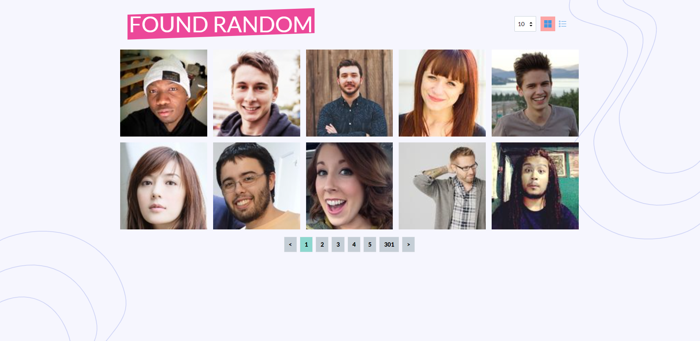

# Random User Display
This is a prject to using [RandomAPI](https://randomuser.me/) to display user card


## Table of contents

- [Overview](#overview)
  - [The challenge](#the-challenge)
  - [Screenshot](#screenshot)
  - [Links](#links)
- [My process](#my-process)
  - [Built with](#built-with)
- [How to run](#run)
## Overview

### The challenge

- pug
  - This is my first time using pug, spent some time to figure out syntax, and I thought it was pretty cool, I would consider using it in the next side project.

- vue3 script setup
  - it's a new feature from vue compile-time syntactic sugar, and also spent some the to read the documentation that new syntax

- tailwindcss
  - Infrequently used, so the syntax is not very familiar, need to check the documentation from time to time

### Screenshot

***Desktop***



***Mobile***


### Links

- Repo URL: [Repo](https://github.com/yuenu/user-list)
- Live Site URL: [Live demo](https://user-display-f9607.web.app/)


## My process
### Built with

- HTML(Pug)
- CSS(SCSS)
- Vue.js(vue3 script setup)
- Tailindcss
- Typescript
- vite


### Code quality

- ESlint
- Prettier
- Husky pre-commit hook w/ lint-staged

## Run

```bash
npm ci
npm run dev
```
